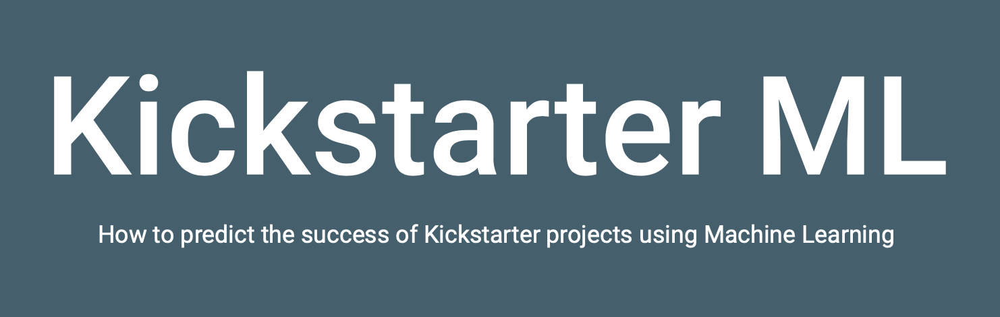

# Machine Learning Project: Kickstarter



This repository contains the jupyter notebooks for the machine learning project looking at the kickstarter dataset.

Data used is the kickstarter project dataset (not uploaded on github).

---
## __Files__

### __Preprocessing.ipynb__

Contains the preprocessing steps:
- loading the data and discarding the columns that won't be used
- check for missing values and exclude outliers
- feature engineering: creating new columns based on existing ones
- save the preprocessed data 
- apply a dummy classifier to the data

Note: this notebook uses a csv file of the combined dataset, not the individual csv files for kickstarter_000.csv to kickstarter_055.csv

### __EDA1_profiling.ipynb__

The pandas profiling report for the dataset.

### __eda_plots.ipynb__

The plots for the exploratoy data analysis.

### __naive_bayes.ipynb__

Trains a Naive Bayes Classifier on part of the dataset (train data) and evaluates it on the rest of the dataset (test data).

### __log_reg.ipynb__

Trains a Logistic Regression Classifier on part of the dataset (train data) and evaluates it on the rest of the dataset (test data).

### __randomforest_model.ipynb__

Trains the following classifiers on part of the dataset (train data) and evaluates them on the rest of the dataset (test data):
- a simple decision tree
- a support vector machine
- a random forest

### __logreg_model.sav__

The best logistic regression classifier as determined by the gridsearch in log_reg.ipynb

### __requirements.txt__

Contains the list of libraries needed for the notebooks.

### preprocessing.py

Takes a dataset (specified inside the script) and goes through the preprocessing steps in preprocessing.ipynp
Saves 3 different preprocessed files:
- preprocessed data with raw goal in usd
- preprocessed data with log transformed goal in usd
- preprocessed data with categories und countries encoded as dummy variables

### model.py

Takes the preprocessed data with dummy variables (specified inside the script), splits it into train and test datasets, trains a random forest model on the train dataset.
Then makes predictions on the test dataset and evaluates them with a classification report and a confusion matrix.

---

## __Environment__

Use the requirements file in this repo to create a new environment.

```BASH
pyenv local 3.9.4
python -m venv .venv
source .venv/bin/activate
pip install --upgrade pip
pip install -r requirements.txt
```
